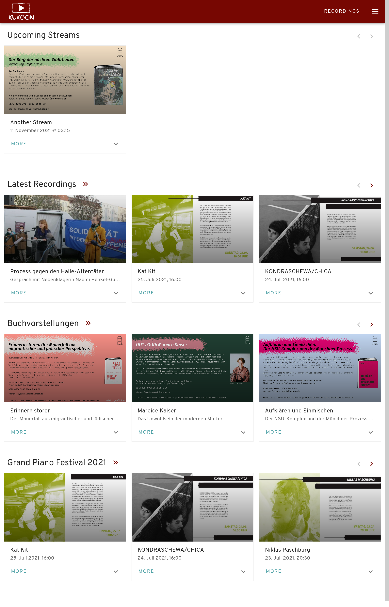
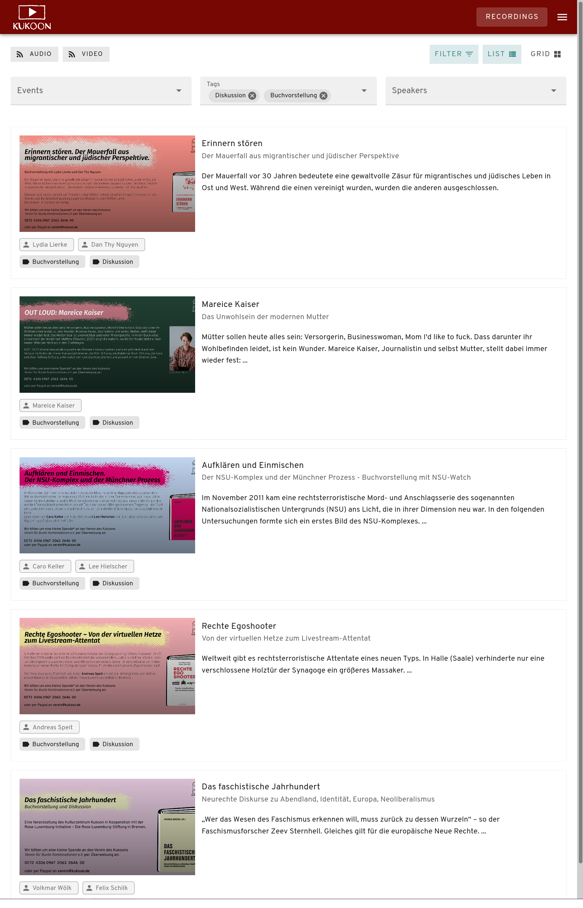
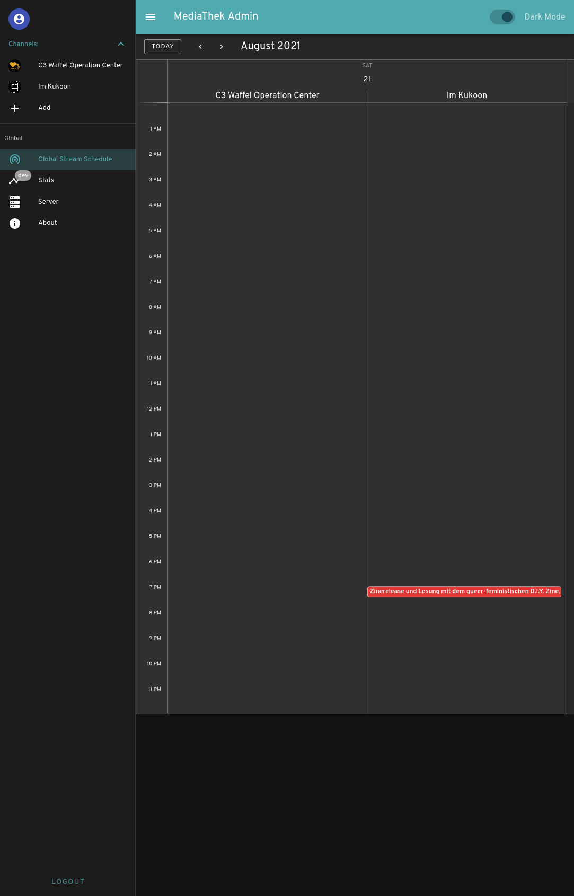
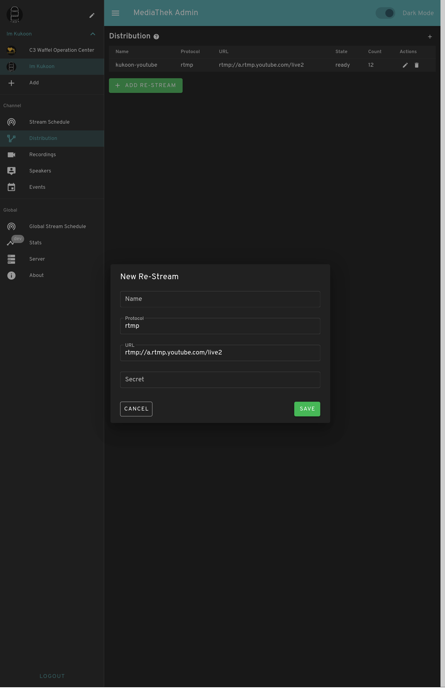
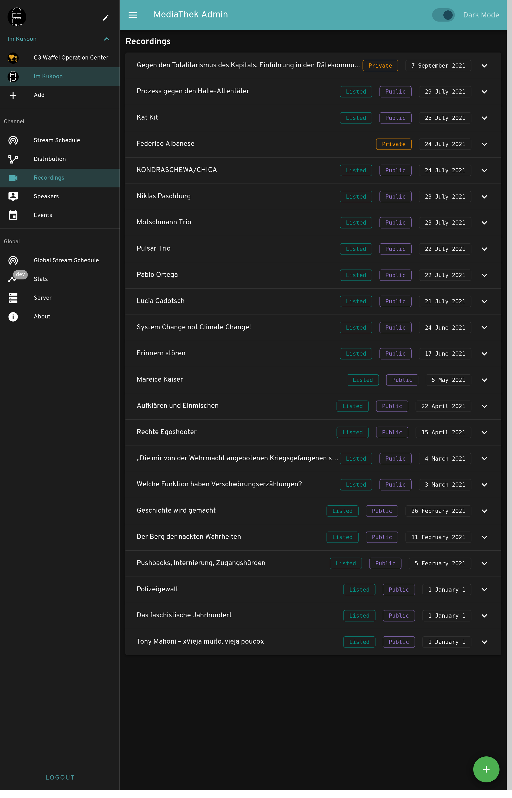

== media-ui

https://gitlab.com/kukoon/mediathek/media-ui/-/commits/main[image:https://gitlab.com/kukoon/mediathek/media-ui/badges/main/pipeline.svg[pipeline status]]

Media-UI is the frontend of our organisation’s streaming and media platform. It is built with https://vuejs.org/[vue 2] & link:vuetifyjs.com/[vuetify]. The underlying API is written in https://go.dev/[Go] and lives at https://gitlab.com/kukoon/mediathek/media-server[gitlab.com/kukoon/mediathek/media-server]. To generate webp previews we use our experimental https://github.com/Kukoon/thumbnailer[thumbnailer].

=== Features

* ☒ Multi Channel Support
* ☒ Multi Language Support
* ☒ Events, Tags, Speakers for Streams and Recordings
** ☒ Events management per Channel
** ☒ Speakers management per Channel
** ☐ Tags management per Superadmim
* ☒ simple Live Chat
** ☐ with Moderation
* ☒ simple View Counter
** ☐ from Prometheus for HA
* ☒ Audio & Video RSS Feeds
* ☒ Filterable Recordings Views (only exclusive filtering as of now)
* ☒ Multiple Distribution Channels
* ☒ Streaming Schedule in Calendar
* ☒ Private, Public, Listed Recordings

=== Frontend

==== User

Take a look here https://media.kukoon.de[media.kukoon.de]

[cols="^,^",options="header",]
|===
|Home |Recordings
| |
|===

==== Admin

===== Overview

[cols="^,^",options="header",]
|===
|Overview |-
| |-
|===

===== Channel

[width="100%",cols="^50%,^50%",options="header",]
|===
|Streams |Distribution / RTMP-Push / ReStream
|image:docs/modules/ROOT/images/admin_channel_stream.png[Streams of Channel] |
|===

[cols="^,^",options="header",]
|===
|Recordings |-
| |-
|===

=== Project setup

....
yarn install
....

==== Compiles and hot-reloads for development

....
yarn serve
....

==== Compiles and minifies for production

....
yarn build
....

==== Lints and fixes files

....
yarn lint
....

==== Customize configuration

See https://cli.vuejs.org/config/[Configuration Reference].
