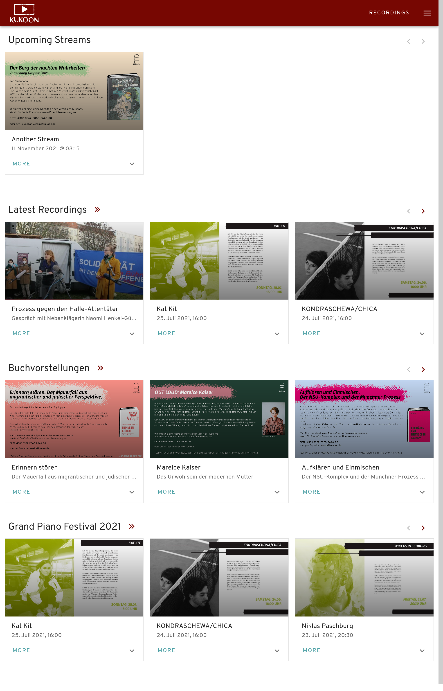
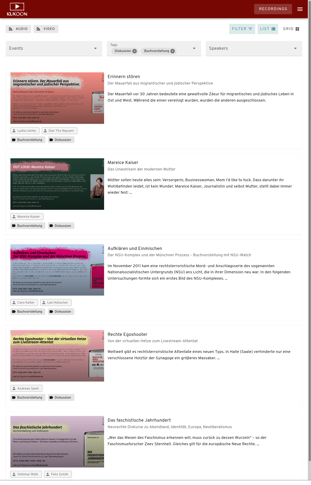
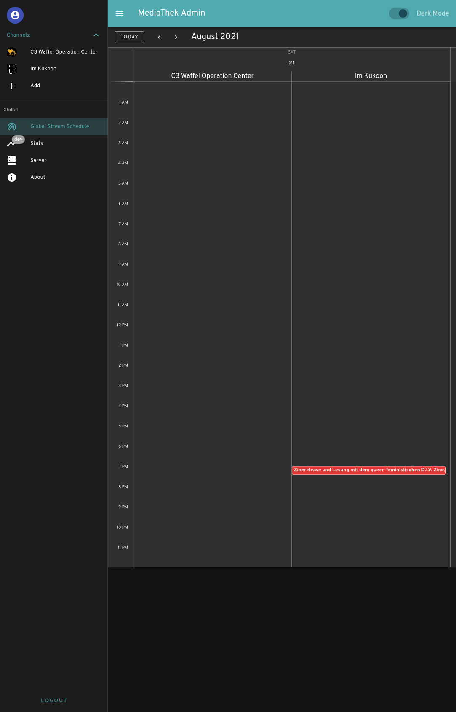
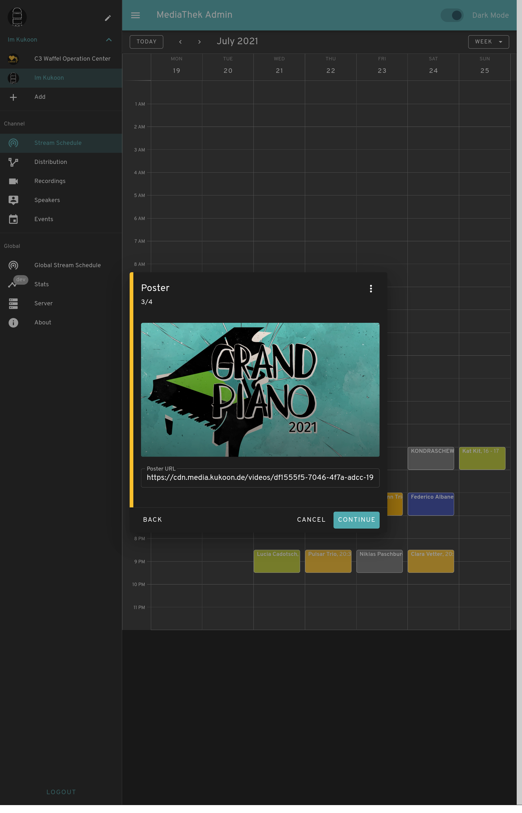
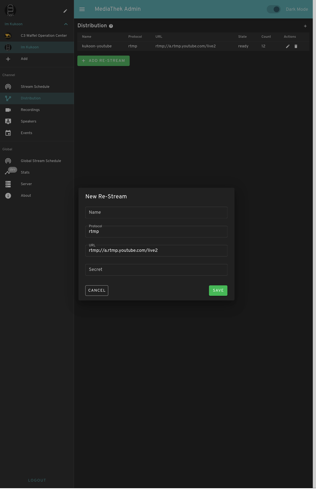
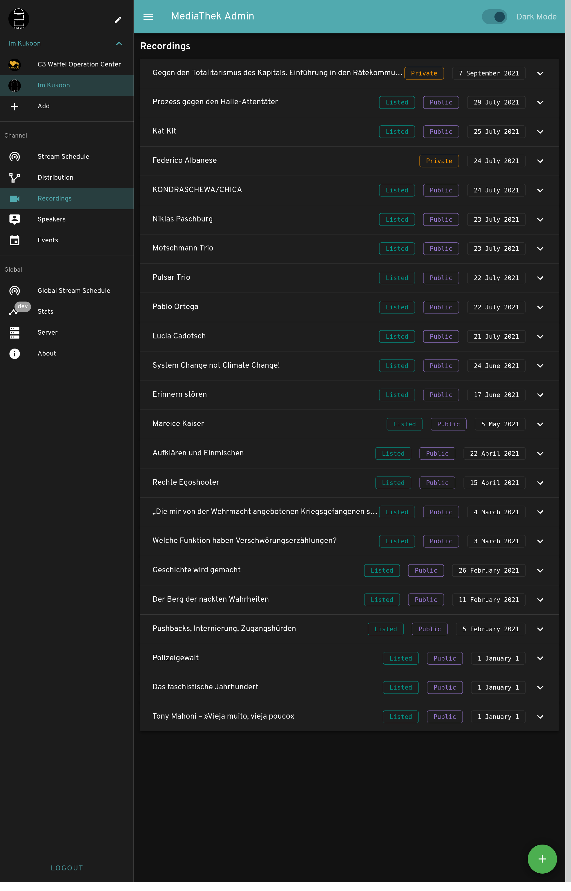

# media-ui


Media-UI is the frontend of our organisation's streaming and media platform. It is built with [vue 2](https://vuejs.org/) & [vuetify](vuetifyjs.com/). The underlying API is written in [Go](https://go.dev/) and lives at [github.com/Kukoon/media-server](https://go.dev/). To generate webp previews we use our experimental [thumbnailer](https://github.com/Kukoon/thumbnailer).

## Features

 - [ ] Multi Channel Support
 - [ ] Multi Language Support
 - [x] Events, Tags, Speakers
 - [x] simple XMPP Live Chat
 - [x] simple View Counter
 - [x] Audio & Video RSS Feeds
 - [x] Filterable Recordings Views (only exclusive filtering as of now)
 - [x] Multiple Distribution Channels
 - [x] Streaming Schedule in Calendar
 - [x] Private, Public, Listed Recordings

## Frontend

### User

Take a look here [media.kukoon.de](https://media.kukoon.de)

Home                    | Recordings
:-------------------------:|:-------------------------:
  | 

### Admin

#### Overview

Overview                   | -
:-------------------------:|:-------------------------:
 | - 


#### Channel

Streams                    | Distribution / RTMP-Push / ReStream
:-------------------------:|:-------------------------:
 | 

Recordings | -
:-------------------------:|:-------------------------:
 | -

## Project setup
```
yarn install
```

### Compiles and hot-reloads for development
```
yarn serve
```

### Compiles and minifies for production
```
yarn build
```

### Lints and fixes files
```
yarn lint
```

### Customize configuration
See [Configuration Reference](https://cli.vuejs.org/config/).
